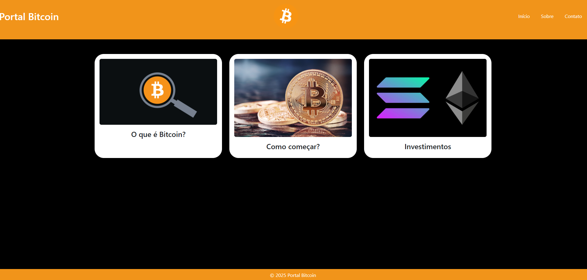
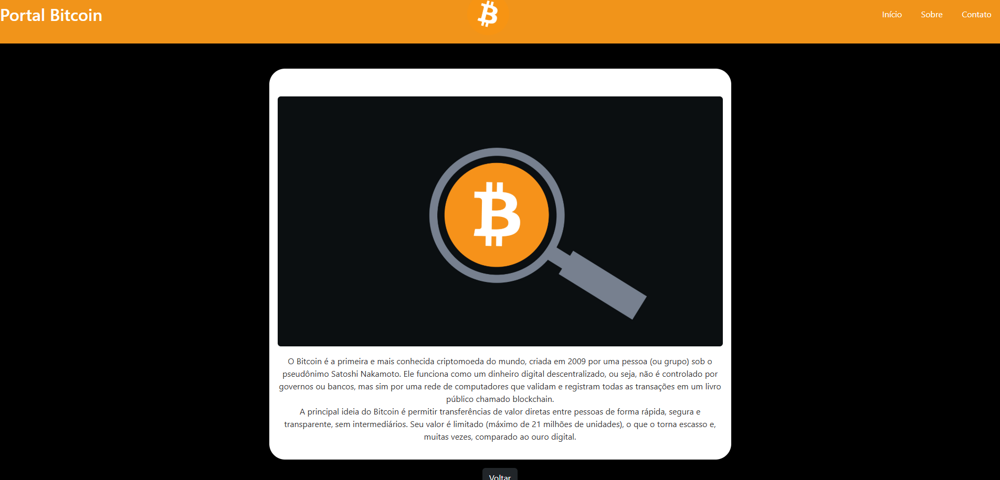
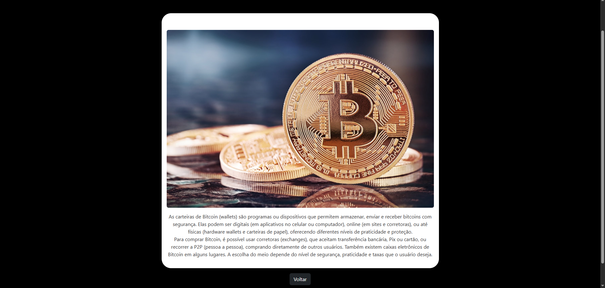
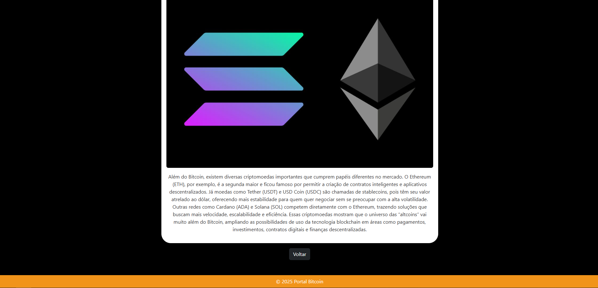

# Trabalho Prático 05 - Semanas 7 e 8

**Páginas de detalhes dinâmicas**

Nessa etapa, vamos evoluir o trabalho anterior, acrescentando a página de detalhes, conforme o  projeto escolhido. Imagine que a página principal (home-page) mostre um visão dos vários itens que existem no seu site. Ao clicar em um item, você é direcionado pra a página de detalhes. A página de detalhe vai mostrar todas as informações sobre o item do seu projeto. seja esse item uma notícia, filme, receita, lugar turístico ou evento.

Leia o enunciado completo no Canvas. 

**IMPORTANTE:** Assim como informado anteriormente, capriche na etapa pois você vai precisar dessa parte para as próximas semanas. 

**IMPORTANTE:** Você deve trabalhar e alterar apenas arquivos dentro da pasta **`public`,** mantendo os arquivos **`index.html`**, **`styles.css`** e **`app.js`** com estes nomes, conforme enunciado. Deixe todos os demais arquivos e pastas desse repositório inalterados. **PRESTE MUITA ATENÇÃO NISSO.**

## Informações Gerais

- Nome: João Victor Vial Leite Soares 
- Matricula: 774152
- Proposta de projeto escolhida: Blog informativo sobre bitcoin e universo cripto 
- Breve descrição sobre seu projeto: A ideia é um projeto que possa introduzir as pessoas à tecnlogia do bitcoin a partir de artigos que explicam seu funcionamento e talvez mais algumas outras features que eu espero aprender na disciplina como acesso de api pra conseguir ver em tempo real no site o valor do bitcoin e de provavelmente outras criptos ou outras tecnicas que poderiam deixar o projeto mais profissional e util. Nessa versão do código fiz algumas ligeiras mudanças nele mantendo ainda a estrutura original, ainda acho que pode melhorar mas não tenho certeza de como poderia ser feito.

## Print da Home-Page



## Print da página de detalhes do item





## Cole aqui abaixo a estrutura JSON utilizada no app.js

const itens = [
  { id: 1, titulo: "O que é Bitcoin?", img: "img/btc2.png", texto: "O Bitcoin é a primeira e mais conhecida criptomoeda do mundo, criada em 2009 por uma pessoa (ou grupo) sob o pseudônimo Satoshi Nakamoto. Ele funciona como um dinheiro digital descentralizado, ou seja, não é controlado por governos ou bancos, mas sim por uma rede de computadores que validam e registram todas as transações em um livro público chamado blockchain. <br> A principal ideia do Bitcoin é permitir transferências de valor diretas entre pessoas de forma rápida, segura e transparente, sem intermediários. Seu valor é limitado (máximo de 21 milhões de unidades), o que o torna escasso e, muitas vezes, comparado ao ouro digital." },
  { id: 2, titulo: "Como começar?", img: "img/btc1.png", texto: "As carteiras de Bitcoin (wallets) são programas ou dispositivos que permitem armazenar, enviar e receber bitcoins com segurança. Elas podem ser digitais (em aplicativos no celular ou computador), online (em sites e corretoras), ou até físicas (hardware wallets e carteiras de papel), oferecendo diferentes níveis de praticidade e proteção. <br> Para comprar Bitcoin, é possível usar corretoras (exchanges), que aceitam transferência bancária, Pix ou cartão, ou recorrer a P2P (pessoa a pessoa), comprando diretamente de outros usuários. Também existem caixas eletrônicos de Bitcoin em alguns lugares. A escolha do meio depende do nível de segurança, praticidade e taxas que o usuário deseja." },
  { id: 3, titulo: "Investimentos", img: "img/eth-sol.png", texto: "Além do Bitcoin, existem diversas criptomoedas importantes que cumprem papéis diferentes no mercado. O Ethereum (ETH), por exemplo, é a segunda maior e ficou famoso por permitir a criação de contratos inteligentes e aplicativos descentralizados. Já moedas como Tether (USDT) e USD Coin (USDC) são chamadas de stablecoins, pois têm seu valor atrelado ao dólar, oferecendo mais estabilidade para quem quer negociar sem se preocupar com a alta volatilidade. <br>Outras redes como Cardano (ADA) e Solana (SOL) competem diretamente com o Ethereum, trazendo soluções que buscam mais velocidade, escalabilidade e eficiência. Essas criptomoedas mostram que o universo das “altcoins” vai muito além do Bitcoin, ampliando as possibilidades de uso da tecnologia blockchain em áreas como pagamentos, investimentos, contratos digitais e finanças descentralizadas." }
];

```javascript
const dados = [
  {
    "id": 1,
    "titulo": "Prefeitura Lança Plano de Mobilidade Urbana",
    "descricao": "Novo plano do transporte público.",
    "conteudo": "A Prefeitura apresentou nesta segunda-feira um novo plano de mobilidade urbana.",
    "categoria": "Cidades",
    "autor": "Joana Ribeiro",
    "data": "2025-03-30",
    "imagem": "img/mobilidade.jpg"
  }
]
```